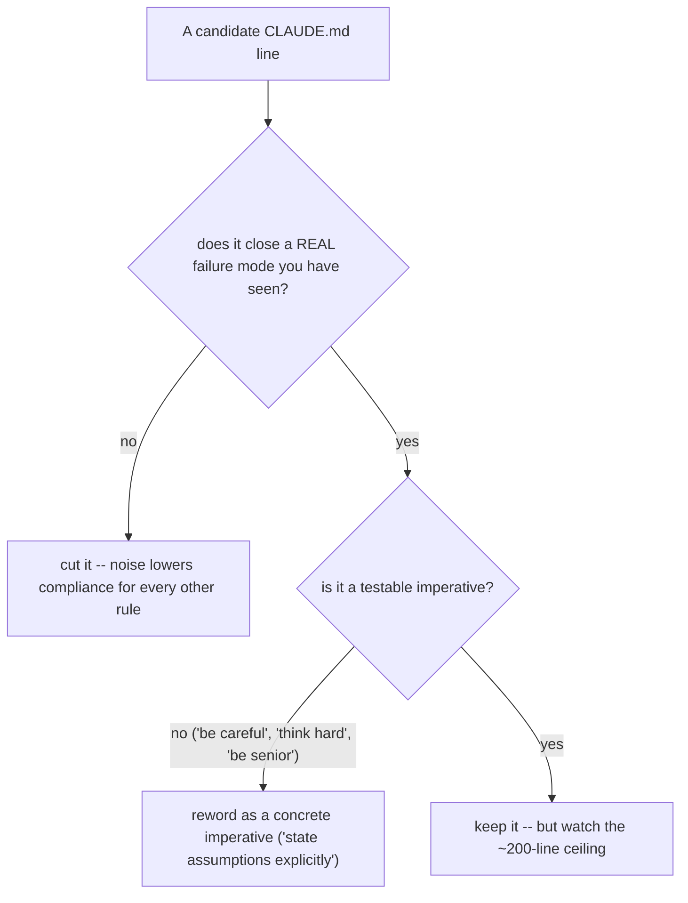

# CLAUDE.md rules -- a behavioral contract, not a wishlist

CLAUDE.md is the most under-used file in a Claude Code project. Per Anthropic's
docs it is ADVISORY -- Claude follows it most of the time, not always -- and
compliance falls off as the file grows (the often-cited rough ceiling is ~200
lines; past it, important rules get buried and Claude pattern-matches to "rules
exist" without reading them). So the file is not a place to dump every preference;
it is a contract where every rule closes a SPECIFIC failure mode you have actually
seen.

Source: authored from a Mnimiy (@Mnilax) X article (2026-05-09), itself built on
Andrej Karpathy's Jan-2026 thread and Forrest Chang's 4-rule CLAUDE.md. The metrics
(41% -> 3% mistake rate, 30 codebases, "120k stars") are the creators' UNVERIFIED
claims. The advisory nature and the compliance-vs-length tradeoff are real (see the
claude-md-config concept / docs.claude.com). The rules themselves are sound
engineering discipline; keep them grounded, not as gospel numbers.

## The mental model
Every rule must answer one question: WHAT MISTAKE DOES THIS PREVENT? If a line
does not map to a failure mode you have actually hit, cut it. A 6-rule CLAUDE.md
tuned to your real mistakes beats a 12-rule one with 6 rules you will never need.

## The 13-rule template (keep the ones that fit; drop the rest)
Rules 1-4 are the floor (Karpathy / Forrest Chang); 5-12 cover the multi-step,
multi-codebase, agent-orchestration problems the floor does not; 13 corrects a
model bias worth knowing about.

1. Think before coding -- state assumptions; ask rather than guess; present
   interpretations when ambiguous; push back when a simpler approach exists.
2. Simplicity first -- minimum code that solves the problem; nothing speculative;
   no abstractions for single-use code.
3. Surgical changes -- touch only what you must; do not "improve" adjacent code,
   comments, or formatting; match existing style.
4. Goal-driven execution -- define success criteria and loop until verified;
   define success, not steps.
5. Use the model only for judgment calls -- classification, drafting,
   summarization, extraction. NOT routing, retries, status-code handling, or
   deterministic transforms. If code can answer, code answers.
6. Token budgets are not advisory -- set a per-task and per-session budget; if
   approaching it, summarize and start fresh; surface the breach, do not overrun.
7. Surface conflicts, do not average them -- if two patterns contradict, pick one
   (more recent / more tested), explain why, flag the other. Blended code is the
   worst code.
8. Read before you write -- before adding code, read the file's exports, the
   immediate caller, and shared utilities. "Looks orthogonal" is the dangerous
   phrase.
9. Tests verify intent, not just behavior -- a test that cannot fail when the
   business logic changes is wrong (a passing test on a function returning a
   constant proves nothing).
10. Checkpoint after every significant step -- summarize what was done, verified,
    and left; do not continue from a state you cannot describe back.
11. Match the codebase's conventions, even if you disagree -- conformance over
    taste inside the codebase; if a convention is harmful, surface it, do not fork
    it silently.
12. Fail loud -- "completed" is wrong if anything was skipped silently; default to
    surfacing uncertainty, not hiding it. (This is the reward-hacking / silent-
    success failure mode, made a rule.)
13. Do not over-weight development cost in technical decisions -- the model
    estimates effort from HUMAN-developer priors, so it silently treats "expensive"
    options as costlier than they are for an agent and defaults to cheap, low-
    quality, hard-to-maintain solutions. Tell it to choose for quality, scalability,
    and maintainability, and to treat its own build cost as low. (Source: Kun Chen /
    @kunchenguid, 2026-06-20, UNVERIFIED -- but a real and non-obvious bias; ask a
    model to estimate a project in days/weeks, then watch it build it in minutes.)

Append project-specific rules (stack, test command, error patterns) BELOW these,
and keep the combined file under ~200 lines.

## What does NOT work (the author's tested negatives)
- Untestable exhortations: "be careful", "think hard", "really focus", "act
  senior" -- compliance collapses (~30%) because they are not checkable. Replace
  with concrete imperatives.
- Examples instead of rules -- examples are heavier (about 3 examples cost as much
  context as ~10 rules) and Claude over-fits to them. Prefer abstract rules.
- More than ~12-14 rules -- compliance fell sharply past 14 in his testing; the
  length ceiling is real.
- Rules that depend on tooling that may not exist ("always use eslint") -- they
  fail silently when the tool is absent. Phrase capability-agnostically ("match
  the codebase's enforced style").
- A 4,000-token wishlist -- compliance drops toward 30%. The file is a contract,
  not a dump.

## Memory + continuity blocks (the additive layer for long-running work)
Beyond behavioral rules, a CLAUDE.md (or sibling files it points to) can give
Claude the closest thing to memory across sessions. These paste-ready blocks pair
with the compounding-memory concept; add them when work spans many sessions.
(Source: an AnatoliKopadze CLAUDE.md article, 2026-05-01, UNVERIFIED metrics.)
- DECISIONS -> a MEMORY.md the agent appends to after any significant decision
  (## date / decision / what was decided / why / what was rejected), and READS at
  the start of every session before acting -- so it stops re-suggesting what you
  already ruled out.
- FAILURES -> an ERRORS.md: when an approach takes more than ~2 tries, log what
  failed, what finally worked, and the note for next time; check it before
  re-attempting a similar task. Stops you solving the same problem twice.
- SESSION HANDOFF -> on "wrap up", write a session summary (worked on / completed
  / in progress / decisions / next session) so the next session opens with full
  context instead of 15 minutes of re-reading.
These are instructions you put in CLAUDE.md; the discipline above still applies --
keep them only if your work actually spans sessions, and stay under the ceiling.

## You have understood when
- You can say why CLAUDE.md is advisory and why length is the enemy of compliance.
- For any rule in your file, you can name the exact mistake it prevents -- and you
  cut the ones you cannot.
- You phrase every rule as a testable imperative, not an exhortation.

## Relation to the curriculum (ConceptForge)
The why lives in claude-md-config (CLAUDE.md as persistent, advisory instruction;
compliance vs length) and reward-hacking (Rule 12, the silent success that looks
like a win). This skill is the reusable HOW: a tuned ruleset + the discipline to
keep only what maps to real failure modes. Apply it to the CLAUDE.md in each forge
repo -- prune each to the rules that repo's work actually needs.
