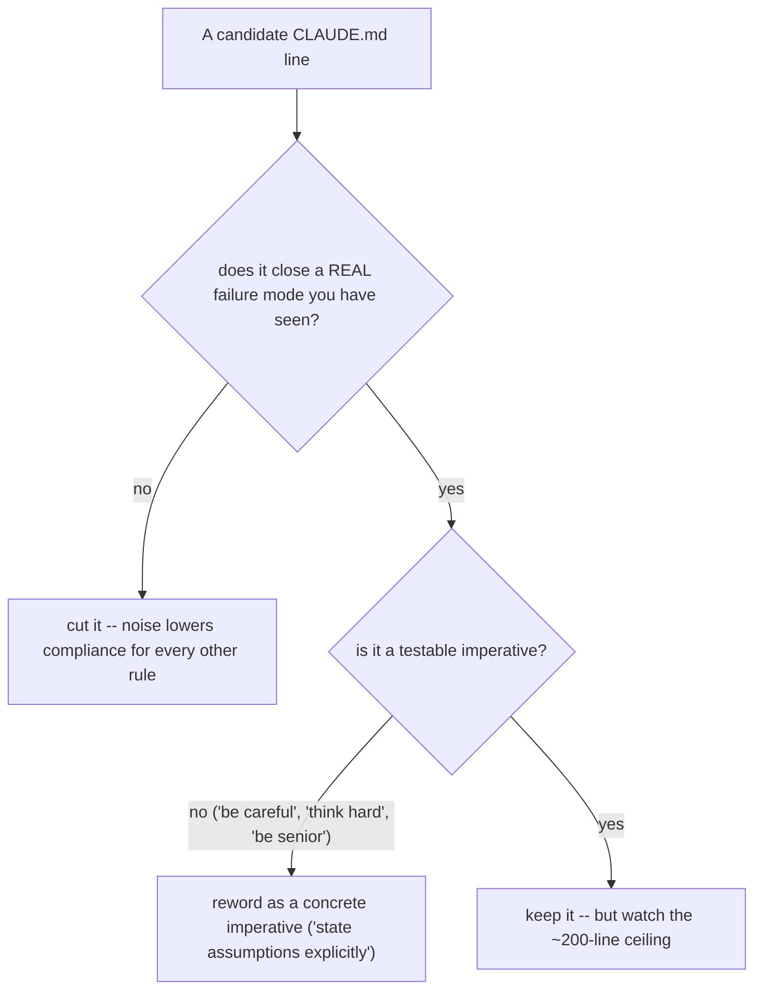

# CLAUDE.md rules -- a behavioral contract, not a wishlist

CLAUDE.md is the most under-used file in a Claude Code project. Per Anthropic's
docs it is ADVISORY -- Claude follows it most of the time, not always -- and
compliance falls off as the file grows (the often-cited rough ceiling is ~200
lines; past it, important rules get buried and Claude pattern-matches to "rules
exist" without reading them). So the file is not a place to dump every preference;
it is a contract where every rule closes a SPECIFIC failure mode you have actually
seen.

Source: authored from a Mnimiy (@Mnilax) X article (2026-05-09), itself built on
Andrej Karpathy's Jan-2026 thread and Forrest Chang's 4-rule CLAUDE.md. The metrics
(41% -> 3% mistake rate, 30 codebases, "120k stars") are the creators' UNVERIFIED
claims. The advisory nature and the compliance-vs-length tradeoff are real (see the
claude-md-config concept / docs.claude.com). The rules themselves are sound
engineering discipline; keep them grounded, not as gospel numbers.

## The mental model
Every rule must answer one question: WHAT MISTAKE DOES THIS PREVENT? If a line
does not map to a failure mode you have actually hit, cut it. A 6-rule CLAUDE.md
tuned to your real mistakes beats a 13-rule one with 7 rules you will never need.

```mermaid
flowchart TD
    Rule["A candidate CLAUDE.md line"] --> Q{"does it close a REAL failure mode you have seen?"}
    Q -->|"no"| Cut["cut it -- noise lowers compliance for every other rule"]
    Q -->|"yes"| Test{"is it a testable imperative?"}
    Test -->|"no ('be careful', 'think hard', 'be senior')"| Reword["reword as a concrete imperative ('state assumptions explicitly')"]
    Test -->|"yes"| Keep["keep it -- but watch the ~200-line ceiling"]
```

Two amendments from "The direction of travel" below, stated here because this is
the section people act on. FIRST, the template's rules are written as bare
imperatives, which is right for the testable form and wrong where the rule is
really a preference: attach the REASON to anything you would otherwise write as a
"never", and mark a preference as a preference so the model can trade it off.
SECOND, on count: the ceiling is real and the template is deliberately at it, so
these thirteen are a MENU, not a starting set. Take the ones matching mistakes you
have actually made -- typically six or seven -- which leaves room for the
project-specific rules below without crossing the compliance cliff. Thirteen
generic rules plus your own is already past it.

## The 13-rule template (a menu -- keep the few that fit, drop the rest)
Rules 1-4 are the floor (Karpathy / Forrest Chang); 5-12 cover the multi-step,
multi-codebase, agent-orchestration problems the floor does not; 13 corrects a
model bias worth knowing about.

1. Think before coding -- state assumptions; ask rather than guess; present
   interpretations when ambiguous; push back when a simpler approach exists.
2. Simplicity first -- minimum code that solves the problem; nothing speculative;
   no abstractions for single-use code.
3. Surgical changes -- touch only what you must; do not "improve" adjacent code,
   comments, or formatting; match existing style.
4. Goal-driven execution -- define success criteria and loop until verified;
   define success, not steps.
5. Use the model only for judgment calls -- classification, drafting,
   summarization, extraction. NOT routing, retries, status-code handling, or
   deterministic transforms. If code can answer, code answers.
6. Token budgets are not advisory -- set a per-task and per-session budget; if
   approaching it, summarize and start fresh; surface the breach, do not overrun.
7. Surface conflicts, do not average them -- if two patterns contradict, pick one
   (more recent / more tested), explain why, flag the other. Blended code is the
   worst code.
8. Read before you write -- before adding code, read the file's exports, the
   immediate caller, and shared utilities. "Looks orthogonal" is the dangerous
   phrase.
9. Tests verify intent, not just behavior -- a test that cannot fail when the
   business logic changes is wrong (a passing test on a function returning a
   constant proves nothing).
10. Checkpoint after every significant step -- summarize what was done, verified,
    and left; do not continue from a state you cannot describe back.
11. Match the codebase's conventions, even if you disagree -- conformance over
    taste inside the codebase; if a convention is harmful, surface it, do not fork
    it silently.
12. Fail loud -- "completed" is wrong if anything was skipped silently; default to
    surfacing uncertainty, not hiding it. (This is the reward-hacking / silent-
    success failure mode, made a rule.)
13. Do not over-weight development cost in technical decisions -- the model
    estimates effort from HUMAN-developer priors, so it silently treats "expensive"
    options as costlier than they are for an agent and defaults to cheap, low-
    quality, hard-to-maintain solutions. Tell it to choose for quality, scalability,
    and maintainability, and to treat its own build cost as low. (Source: Kun Chen /
    @kunchenguid, 2026-06-20, UNVERIFIED -- but a real and non-obvious bias; ask a
    model to estimate a project in days/weeks, then watch it build it in minutes.)

Append project-specific rules (stack, test command, error patterns) BELOW these,
and keep the combined file under ~200 lines.

CORROBORATION, from a second and independent practitioner: Santi (@santtiagom_,
engineer at MercadoLibre), in an article that reached 2.3M views on 2026-03-22, gives
the same figure unprompted -- keep the file under 200 lines, because past that "Claude
Code empieza a ignorar instrucciones". Two people arriving at the same number from
separate testing is worth more than either statement alone. It remains a practitioner
figure, not a documented limit.

AND THE PART THE CEILING LEAVES UNANSWERED: WHERE DOES THE OVERFLOW GO? A ceiling tells
you to stop writing and says nothing about what to do with the rules you still need. The
answer is `.claude/rules/` -- modular rule files scoped to a path or file type, which
load on demand when a matching file is read rather than sitting in every request. So the
two facts are one decision: the 200-line ceiling is the budget for rules that must ALWAYS
be loaded, and `.claude/rules/` is where everything else belongs. A project outgrowing
the ceiling is usually not a project with too many rules; it is a project with
path-specific rules living in the global file. Split by path before you start cutting.

## One rule to add whenever the agent designs against a named product
Write it as a PROHIBITION naming the object types, not as a request to be accurate: do not invent a plugin,
connector, plan, feature, limit, command, file path or UI step; if a capability is needed and you cannot confirm it
exists, state the gap and stop. Without this line the output is a plausible build plan referencing settings that do
not exist, and it reads as correct until somebody follows it. The failure it closes is specific -- the model filling
a product-shaped hole with the nearest thing it has seen. Pair it with a second line requiring every product-specific
step to cite the documentation page it came from, so the unverifiable steps are visible in the output instead of
being discovered at build time. This estate has hit exactly that failure from the reading side: one source in the
2026-09-18 intake states the routine run cap two different ways in the same article, and Anthropic publishes no
number at all. (@hooeem, 2026-09-18 intake; UNVERIFIED practitioner framing, no figure of his is carried.)

## What does NOT work (the author's tested negatives)
- Untestable exhortations: "be careful", "think hard", "really focus", "act
  senior" -- compliance collapses (~30%) because they are not checkable. Replace
  with concrete imperatives.
- Examples instead of rules -- examples are heavier (about 3 examples cost as much
  context as ~10 rules) and Claude over-fits to them. Prefer abstract rules.
- More than ~12-14 rules -- compliance fell sharply past 14 in his testing; the
  length ceiling is real.
- Rules that depend on tooling that may not exist ("always use eslint") -- they
  fail silently when the tool is absent. Phrase capability-agnostically ("match
  the codebase's enforced style").
- A 4,000-token wishlist -- compliance drops toward 30%. The file is a contract,
  not a dump.

## Write "when X, do Y" instead of "never X"
THE DIRECTION IS FIRST-PARTY. Anthropic's prompting best-practices page lists as its first steering rule: "Tell
Claude what to do instead of what not to do", with the worked example -- instead of "Do not use markdown in your
response", try "Your response should be composed of smoothly flowing prose paragraphs."
BE PRECISE ABOUT WHAT IS PROVEN. A practitioner framing of this claims prohibitions AMPLIFY the forbidden concept by
putting it in context. That mechanism is UNVERIFIED and is not carried. What is documented is narrower and still
worth acting on: Anthropic gives the rule under controlling output FORMAT, as a steerability technique, not as a
general law about instructions. And their own sample prompt on the same page mixes both forms -- it states the
positive behaviour at length and then adds an explicit "DO NOT use ordered lists ... unless" with the exception
spelled out. That is the shape to copy: a prohibition is fine when a positive alternative sits beside it and the
exception is named, and a bare "never X" with no alternative is the weak form.
THE AUDIT, worth running once on an existing file. Grep the file for never, don't, avoid, do not and stop. For each
hit ask what the agent should do INSTEAD at that moment. Where you can answer, rewrite it as a "when X, do Y" line
and delete the prohibition. Where you cannot answer, that is the finding -- you have a rule that forbids something
without naming the alternative, and the agent has to invent one. Keep the prohibition only where the alternative really is
"stop and ask", and then say exactly that.
NOTE FOR THIS ESTATE SPECIFICALLY: the standing rules, the memory files and several skills here are written as
prohibitions. This section is not an instruction to rewrite them all. It is the reason to write the NEXT rule as a
behaviour rather than a ban, and to add the alternative when an old rule is edited for another reason anyway. (@ArchiveExplorer, read 2026-09-18; the account ships runnable code and cites issues by number, which is why it is carried.)

## The direction of travel -- your file is probably too long NOW

Everything above is about which rules earn their place. This is about the fact
that the answer keeps changing in one direction, and it comes from the team that
writes the other side of the contract: Anthropic cut the Claude Code system
prompt by roughly 80% (Thariq Shihipar, Claude Code team, 2026-07 -- his figure,
recorded as stated). Their stated reason is the useful part, because it applies
directly to your file: as models get better they need LESS direction, fewer
constraints, and fewer examples.

Three consequences, each of which contradicts an instinct:

- EXAMPLES CONSTRAIN. This skill's tested negative -- Claude over-fits to examples
  -- is now the first-party position too, and stronger: a set of examples reads as
  a specification of the shape you want, so it narrows the space the model will
  explore. Their system prompt used to carry several examples per tool and they
  removed them. Keep an example only where the shape itself is the requirement.
- "NEVER" IS USUALLY A LIE, and the model can tell. When you write never you
  almost always mean "not in the normal case". A model aligned enough to take
  never literally will contort itself to obey it in the case you did not think of.
  GIVE THE REASON INSTEAD -- the reason generalizes to cases the prohibition did
  not anticipate, and it lets the model make the call you would have made.
- HARD CONSTRAINTS STAY HARD, and the distinction is not subtle. A real limit --
  a character count, a schema, a compliance requirement -- is a fact and belongs
  in the file as a fact. What should soften is everything you wrote as a rule when
  you actually meant a preference. Their own example: "keep it under 280
  characters" is a constraint; "I would prefer one post, but a two-post thread is
  fine if it is better" is a preference, and writing it as a preference gets you a
  better result than writing it as a rule.

Independent corroboration from the other side of the market, which matters because
the first-party version could be self-serving: a competitor building a rival coding
agent gives the same advice as a planning principle (Jared Zoneraich, Cognition,
2026-07). Do not let prompt scaffolding that exists to make the model follow
instructions become the thing you depend on, because the models absorb those hacks
and the work evaporates. Two labs with opposite incentives pointing the same way is
about as good as evidence gets here.

A third arrival, from a different discipline again, is what shows this is not
really a rule about instruction files. A designer on the Claude Cowork team
describes their product going through the same collapse (Jenny Wen, Anthropic,
2026-03): an early version had a structured workflow interface -- name your inputs
here, your outputs there, with chat as a secondary path -- and it failed for two
reasons stated together. The model of the day could not follow the workflow
reliably, AND the structure felt like a lot of work to fill in. A later version
offered dials for document type and length; also too much. What shipped was the
plain box, with the structure reduced to a shared to-do list you approve items on.

So the general form, which is worth holding above any of the three cases:
SCAFFOLDING YOU ADD TO COMPENSATE FOR A MODEL LIMITATION BECOMES FRICTION WHEN THE
LIMITATION GOES, and it does not announce itself when that happens -- it just
quietly starts costing more than it returns. That covers a prompt rule, a skill
that encodes a rigid procedure, and a product surface that makes someone fill in
what the model could have inferred. Ask of anything you have built: which model
weakness is this here for, and is that weakness still real?

### Build or wait -- the same law stated as a decision, first-party

The form above is a warning: notice when scaffolding has outlived its reason. The
creator of Claude Code states it as a DECISION you take before building, which is
more useful (Boris Cherny, 2026-06). The Claude Code team keeps a framed copy of
Rich Sutton's Bitter Lesson on the wall, and the operating summary he gives is
NEVER BET AGAINST THE MODEL. The full version, including the per-release recheck
loop, is the agent-engineering bitter-lesson-scaffolding pattern; what follows is
the part that bears on an instructions file.

The trade-off, in his terms. You can build scaffolding -- his word for all the code
that is not the model -- and extend capability in some narrow domain by ROUGHLY
10-20%. Or you can wait a couple of months and get the same thing from the next
model for nothing. Neither is automatically right. What is not optional is making
the choice knowingly, with the default he states outright: ASSUME WHATEVER THE
SCAFFOLDING IS, IT IS TECH DEBT.

That default is the part worth adopting, because it inverts the usual instinct. The
question is not "is this worth building" but "is this worth building GIVEN that I
will probably delete it in a few months." Some things clear that bar easily -- a
verifier, a permission boundary, anything that encodes YOUR domain rather than
compensating for the model. A rule that exists because the model keeps forgetting
something does not.

They live by it visibly. He reports that no part of Claude Code was around six
months earlier, that tools are unshipped every couple of weeks, and that the
product stayed in a terminal for a long time for exactly this reason: there was no
UI they could build that would still be relevant in six months. Betting on scaffold
longevity is how you end up maintaining last year's workaround.

One caution before this becomes an excuse. "Wait for the model" is a decision about
SCAFFOLDING, not about correctness. Verification, permissions and the record of
what you decided are not scaffolding in this sense -- they do not become unnecessary
when the model improves, they become cheaper to satisfy. Do not file them under
tech debt because a compelling founder said scaffolding is.

The corollary the same source states for interfaces applies directly to skills: a
shorthand should be an ACCELERATOR, not the only door. Power users will learn
commands and want them; everything those commands do should still be reachable by
just asking.

Before you conclude a rule is being ignored, rule out the two mechanical causes,
because between them they explain most of it. Grounded in Anthropic's documentation
rather than in a practitioner's account, since this is the kind of claim the lane
gets wrong by relaying.

FIRST, THE SESSION MAY NOT HAVE YOUR EDIT. The root file is loaded at the start of
every session and re-read from disk at COMPACTION. So an edit made mid-session
applies at the next compaction or restart, not immediately -- a rule you just fixed
keeps being broken by the session you fixed it in, and the file is not at fault.
(Two exceptions arrive without a reload: instruction files in SUBDIRECTORIES and
path-scoped rules load on demand when a matching file is read.)

SECOND, THE FILE MAY NOT HAVE LOADED AT ALL. Run `/context` and look at the memory
files list -- if yours is not there, nothing about its wording matters. The
`InstructionsLoaded` hook logs which instruction files loaded, when, and why, which
is the tool for path-scoped rules that are not firing.

THIRD, THE RULE MAY BE WORKING TOO WELL. The opposite symptom -- a session that pauses for
permission, stops short, or drifts from the request -- is often a stale or conflicting
line you forgot was loaded, and knowing which files loaded does not say which line caused
the stop. A standing line that asks: "If an instruction file or skill causes you to ask
for permission, pause, leave requested work unfinished, or diverge from my intent, name
the file, quote the instruction, and say whether it is an explicit requirement or your
interpretation." Check the quoted text really exists in the named file before acting --
a self-report can be invented -- then rescope that one line, not the file.
(@mikenevermiss, 2026-09-11, adapting a line from OpenAI's model guidance; untested on
Claude.)

AND ONE FACT THAT EXPLAINS THE CEILING ITSELF: this content is delivered as a USER
MESSAGE AFTER the system prompt, not as part of it. It is context, not enforced
configuration -- which is why compliance is a distribution rather than a guarantee,
why specific beats vague so reliably, and why anything that MUST happen at a fixed
point belongs in a hook instead of here. Verify in a FRESH session before deciding
a rule does not work; see `cache-aware-sessions` for the cost side of the same
loading behaviour.

The practical instruction: RE-TRIM ON MODEL UPGRADES, not only when the file grows.
There is now a tool for the mechanical half of that trim -- `/doctor` proposes cuts
for a checked-in instructions file, removing what the agent can derive from the
codebase itself (directory layouts, dependency lists, architecture overviews) and
keeping the pitfalls, the rationale, and the conventions that differ from tool
defaults. That division is worth internalizing even if you trim by hand: DERIVABLE
CONTENT IS THE FIRST THING TO CUT, because the agent can go and look.
A rule that closed a real failure mode on last year's model may be closing nothing
now, and you will not notice, because a rule that does nothing looks exactly like
a rule that works. The same applies to skills -- his view is that most CLAUDE.md
files and most skills are currently too long. Pair this with `claude-md-audit`,
whose method (mine your own transcripts for what you actually do) is the way to
find out which rules are still earning anything.

## What the file's own author keeps in his (first-party)

Worth having concretely, because it is far smaller than most people's and the split
explains why (Boris Cherny, 2026-06).

HIS PERSONAL FILE IS TWO LINES. Both are workflow preferences that are true of HIM
rather than of the project: enable auto-merge on a PR he opens, and post it to the
team's channel so someone can approve it. That is the correct content for a personal
file -- how this one human wants the loop to close.

EVERYTHING ELSE LIVES IN THE PROJECT FILE, checked into the repo, and his whole team
contributes to it several times a week. The split is not about importance. It is
about audience: a rule that is true for anyone working in this codebase belongs to
the codebase, and a rule that is true because of how you personally work does not.

THE TRIGGER FOR ADDING A RULE IS AN OBSERVED, PREVENTABLE MISTAKE. His loop is
concrete: he sees a mistake in someone's pull request that the file should have
prevented, and adds it right there, many times a week. Not a planning exercise --
a review habit. That is `memory-lifecycle`'s session mining running at code-review
speed, and it is the reason their shared file stays useful while most grow into
wishlists.

THE TEST FOR WHETHER SOMETHING BELONGS AT ALL IS REPETITION, NOT IMPORTANCE. Asked
why a technique he uses constantly is NOT in his file, his answer is that it is case
by case: the file is a shortcut for things you find yourself saying over and over,
and everything else you can simply ask for. A rule that fires on one task in twenty
is costing every other task and buying nothing.

AND WHEN IT GETS TOO BIG, DELETE IT. His recommendation on hitting the size warning
is not to prune carefully -- it is to delete the file and start fresh, then add back
a little at a time when the model actually goes off track. His prediction for what
you find: with each model you have to add back less. That is a stronger and more
honest procedure than trimming, because trimming preserves whatever you were already
wrong about, and a from-scratch rebuild prices every rule at what it is worth today.

## Memory + continuity blocks (the additive layer for long-running work)
Beyond behavioral rules, a CLAUDE.md (or sibling files it points to) can give
Claude the closest thing to memory across sessions. These paste-ready blocks pair
with the compounding-memory concept; add them when work spans many sessions.
(Source: an AnatoliKopadze CLAUDE.md article, 2026-05-01, UNVERIFIED metrics.)
- DECISIONS -> a MEMORY.md the agent appends to after any significant decision
  (## date / decision / what was decided / why / what was rejected), and READS at
  the start of every session before acting -- so it stops re-suggesting what you
  already ruled out.
- FAILURES -> an ERRORS.md: when an approach takes more than ~2 tries, log what
  failed, what finally worked, and the note for next time; check it before
  re-attempting a similar task. Stops you solving the same problem twice.
- SESSION HANDOFF -> on "wrap up", write a session summary (worked on / completed
  / in progress / decisions / next session) so the next session opens with full
  context instead of 15 minutes of re-reading.
- BRANCH-SCOPED CONTEXT, outside the file. A SessionStart hook with matcher "startup"
  whose command prints a per-branch notes file (e.g. `cat .claude/context-$(git branch
  --show-current).md`) adds that text to the session's context -- SessionStart stdout is
  added as context, and its matchers are startup, resume, clear, compact and fork (hooks
  docs). Branch-specific notes then never sit in CLAUDE.md for every other branch.
  (@Mnilax, 2026-05-24; branch names containing "/" need mapping to a filename.)
These are instructions you put in CLAUDE.md; the discipline above still applies --
keep them only if your work actually spans sessions, and stay under the ceiling.

#### A positive canary, because a failing prohibition tells you nothing
The drift problem with an instruction file is that you cannot tell whether it is still being followed. Watching a
prohibition is useless -- a prohibition is exactly the kind of rule that gets violated under normal operation, so a
violation is not news. Watch a POSITIVE canary instead: put one harmless, distinctive, unmistakable instruction in
the file, something like addressing you by an odd fixed name, and check whether it is still honoured. It costs one
line and nothing else.
The logic is what makes it worth doing. A positive instruction that is specific, harmless and unambiguous has no
competing pull from training -- there is no default behaviour it is fighting. So if THAT stops being followed, the
model has not disagreed with you, it has lost the instruction set: the file fell out of context, was truncated,
was summarised away, or is being outweighed. When the canary goes quiet, stop debugging the rule you care about and
go look at whether the file is reaching the model at all. (@ArchiveExplorer, drained 2026-09-18; issue numbers verified at github.com/anthropics/claude-code.)

### Grammar beats priority labels, and the system prompt has the rights
Writing ABSOLUTE PRIORITY, CRITICAL or OVERRIDE at the top of the file does not create precedence. Those are
positive-shaped labels wrapped around a body that still has to compete with everything else the model was trained
and instructed to do, and the label is a handful of context tokens on one side of that contest.
Six issues in the vendor's own tracker describe this class of conflict, all now CLOSED, which is the part a source
citing them will usually leave out -- read them as a shape that recurs, not as current behaviour:
- 27032, "Model ignores CLAUDE.md instructions despite reading them at session start" (closed 2026-05-16).
- 30730, "Sub-agent dispatch injects hardcoded instructions that conflict with custom agent prompts" (closed
  2026-04-01) -- worth knowing about because a subagent can be carrying instructions you did not write and cannot
  see, which is the likeliest explanation when a subagent ignores its own definition.
- 29709, "Claude Code circumvents PreToolUse:Edit hook via Bash tool" (closed 2026-03-03), the routing-around case
  already covered in agent-bash-security.
- 24318, where frustration in the transcript was read as implicit approval to proceed.
THE WORKING POSTURE: write the file as though everything else in the session has standing and your file has none,
so every rule has to earn its outcome by being concrete rather than by being labelled important. A rule that only
works if it is obeyed as an order is a rule that will eventually not be.

#### Guidance and enforcement are different jobs -- know which one you are writing
A rule in an instruction file is GUIDANCE: it shapes what the model tends to do and it can be outweighed, forgotten
at compaction, or simply not applied on a turn where something else dominates. A permission rule, a hook checking a
post-condition, a schema that rejects a bad record, a test that fails -- these are ENFORCEMENT: they hold whether or
not the model agrees, because the model does not evaluate them.
Most instruction files fail by trying to enforce with guidance. The symptom is a rule that is restated, capitalised,
and moved to the top of the file across successive edits, which is the shape of someone arguing with a mechanism
rather than replacing it. The diagnostic question per rule: if the model decided tomorrow that this rule did not
apply, what would stop it? If the answer is "nothing", the rule is guidance, and it is only appropriate where the
cost of it being ignored is acceptable.
So sort the file once. Anything whose violation is merely annoying stays as guidance and should be written as "when
X, do Y". Anything whose violation is expensive or irreversible moves OUT of the file into the enforcement layer --
this is the same argument as "deny is not ask" in agent-bash-security, arrived at from the writing side rather than
the security side. A file that keeps only the rules it can actually influence is shorter, and the rules that left it
now work.

## Three habits that make an instruction file worse, and the audit that undoes them
1. CAPS-LOCK AS EMPHASIS. Shouting a prohibition repeats the forbidden thing and adds no mechanism. Replace emphasis
   with specificity -- a trigger and a target beat any amount of capitalisation.
2. ADDING A RULE FOR EVERY FAILURE. Each new clause names the thing again and lengthens the file that is paid for on
   every turn. The fix for a rule that did not work is usually deletion and one better rule, not a second rule
   narrowing the first.
3. PRIORITY LABELS. See above.
THE AUDIT, six steps, run it once on an existing file: grep for don't, never, avoid, no, stop and refrain; for each
hit, check whether a paired positive rule exists and DELETE the line outright if none does, because a prohibition
with no alternative is decoration; for each pair, list three concrete edge cases and widen the positive until all
three land inside its scope; rewrite every survivor as "when X, do Y", since "always do Y" is weaker and a bare "do
Y" weaker still; cut the old prohibition once the positive covers it rather than keeping both; then count the rules
before and after. A post-audit file at less than half the original count is the normal outcome, not an overcorrection.
THE SOURCE'S OWN CAVEAT, kept because it is the reason this section is trusted at all: he states plainly that he
found no vendor document declaring this as design, and that his evidence is a published training objective plus
field behaviour across the issues above. His own before-and-after violation counts are small-sample and he says so.
Treat the direction as sound, already supported by first-party prompting guidance, and the numbers as nobody's.

## The scope-gap test, which is the part that makes the rewrite actually work
Rewriting "never X" as "when X, do Y" is not enough on its own, because a positive rule has a SCOPE and the scope
can miss the case that matters. The worked failure: a pair of rules saying never copy entire files between
environments and always use the edit tool for targeted changes. Neither one covers the shell's own copy command, so
both are silent when it is reached for, and the model falls back to whatever its training makes obvious.
THE TEST, and it takes a minute per rule: would EVERY ambiguous concrete action land inside the positive rule's
scope? Walk the two or three ways the thing could actually be done -- the tool, the shell equivalent, the script
that wraps it -- and check each one lands inside. Where a route falls outside, the prohibition beside it is
decorative and the rule you wrote is not the rule that is running.
Two corollaries. Write the positive rule against the OUTCOME rather than the tool ("for any file movement, state
source and destination and wait for confirmation" covers the tool, the shell and the script; "use the edit tool"
covers one of the three). And where the scope cannot be closed in prose, stop writing prose -- that is the case for
a deny rule or a post-condition check, which do not have a scope problem because they see the result rather than the
intent. (@ArchiveExplorer, drained 2026-09-18.)

## The cost of a long instruction file, in arithmetic rather than adjectives
The section above argues the file is probably too long. Here is the number that makes it concrete: an instruction
file enters the prompt on EVERY TURN, not once per session. An 8,640-token file across a 40-turn session is about
345,600 tokens of pure overhead, before a single line of your actual work. Prompt caching softens the price but not
the context cost -- those tokens occupy the window on every turn regardless of what they cost.
Two things follow. Measure your file in tokens and multiply by a realistic turn count before deciding it is fine;
"it is only a few hundred lines" stops sounding cheap at that point. And move anything that is needed only sometimes
into a skill, which loads on demand, rather than an instruction file, which loads always -- Anthropic's own cost
guidance makes the same point and suggests keeping the file under about 200 lines. The rule of thumb that falls out:
a line earns its place in the instruction file only if it should apply to a turn you have not thought of yet.
(Practitioner source, 2026-09-18; the arithmetic is checkable, the file size is theirs.)

## The filename is rented; the instruction layer is owned
This skill is named after a vendor's file, and everything above tells you how to WRITE
one. It has never said WHERE the canonical content should live, which is a different
question and the one that decides what happens when you change tools.

THE ASSET AND THE CONTAINER ARE NOT THE SAME THING. Your instruction layer is
everything an agent reads before it touches your code, and it has four parts: rule
files (standards, commands, boundaries), skills (reusable task procedures), workflows
(review gates, deploy order), and memory (the decision log -- why you dropped that
library, which API version broke things, which convention exists because of an outage).
Swapping the MODEL is a config change. Rebuilding that LAYER in another vendor's format
means rewriting every rule and skill by hand and recovering the decisions that lived
only inside a tool's memory feature. The switching cost is the layer, not the model.
That is also why the memory part belongs in plain markdown under version control rather
than in a vendor memory feature you would have to export someday.

THE FIX: ONE HANDBOOK, MANY THIN ADAPTERS.
- Put the canonical content in a file your PROJECT owns. AGENTS.md is the open
  convention and takes no side; HANDBOOK.md is equally fine. The requirement is only
  that the name is not a vendor's.
- Every vendor-named file becomes a pointer and carries nothing canonical. For Claude
  Code that is a four-line CLAUDE.md whose body is an `@`-import of the handbook.
  Imports resolve relative to the file containing them and chain a few levels deep.
  A symlink (`ln -s AGENTS.md CLAUDE.md`) is the alternative and cannot drift at all,
  since it is one file with two names -- but on Windows it needs Administrator or
  Developer Mode, so prefer the import there.
- Model-specific tuning goes IN THE ADAPTER, below the import. This is the move that
  matters. It is true both that instructions tuned to a model family perform better and
  that maintaining N copies is a tax; putting project substance in the handbook and
  model shaping in the adapter satisfies both, so the argument has nothing left to
  contest inside your repo.
- Keep the handbook short. The under-200-lines guidance in this skill applies to the
  handbook, not just to CLAUDE.md -- a twelve-section speculative manual is worse than
  one page your team actually follows.

PROVE IT, BECAUSE A PORTABILITY CLAIM YOU HAVE NOT TESTED IS A HOPE. Two drills:
1. THE TRIPWIRE. Plant a distinctive rule in the handbook ONLY -- something no agent
   does by default, such as "every new function gets a comment starting with the word
   handbook". Run the same small task in two different agents, at least one of them
   local. You pass when both follow the rule AND the rule exists in exactly one file on
   disk. Two agents obeying one file is the proof; anything less is an assumption.
2. THE DELETION CHECK. Copy the repo to a temp folder, delete every vendor-named file,
   and look at what survives. Rules, workflows and decision log still there means the
   handbook is canonical. Whatever vanished was misfiled, and now you know what to move.
Then make it mechanical: if CI can assert a lockfile exists, it can assert the handbook
exists wherever agents work. That converts vigilance into a check, which is the only
form of vigilance that survives a busy quarter.

WHEN THIS IS NOT WORTH IT. A solo project on one tool that you would rewrite anyway
does not need an adapter layer; the handbook alone is enough. The pattern earns its
keep when more than one tool reads the repo, when more than one person uses different
tools, or when the decision log has grown past what anyone could reconstruct.

Source: Alex Veremeyenko (@alex_verem) X Article, 2026-08-31, built on a dated public
exchange (Shopify's CEO on 2026-08-25 objecting to tools that read only their own
filename, and an Anthropic engineer replying the same day that model families are not
interchangeable and that generic files can cost performance, while conceding the
maintenance tax and pointing at the import as the interim fix). The author states he
built the structure and verified the file mechanics himself. Both the import and
symlink patterns are documented by Anthropic. VERIFY the current import depth and
filename support against live docs before relying on specifics -- vendor conventions
are exactly the thing this section assumes will move.

## You have understood when
- You can say why CLAUDE.md is advisory and why length is the enemy of compliance.
- For any rule in your file, you can name the exact mistake it prevents -- and you
  cut the ones you cannot.
- You phrase every rule as a testable imperative, not an exhortation -- and where
  you were about to write "never", you write the reason instead.
- You re-trim on model upgrades, not only when the file grows, and you can say
  which model weakness each surviving rule is still there for.
