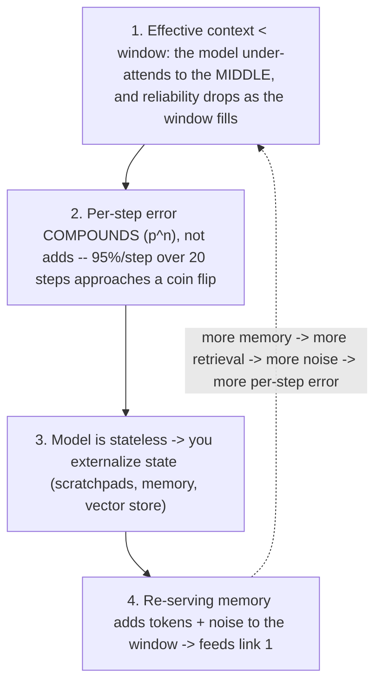

# Context curation -- choose the smallest sufficient context, not the biggest window

The shift this captures: the lever for a long-running agent is not how much
context it CAN hold, it is the quality of the decision about which tokens occupy
the window at each step. Capacity was never the binding constraint. Selection is.
As one practitioner put it: the question every agent answers on every step is
"of everything it knows, what should it be thinking about right now?" A bigger
window does not answer that -- it just gives the agent more to ignore.

Source: authored from a Khairallah AL-Awady (@eng_khairallah1) X article
(2026-06-17), which is a PAID PARTNERSHIP for a vendor memory product (HydraDB).
The failure-loop and selection ANATOMY below is sound and matches Anthropic's own
context guidance; the article's "buy a structured selection layer" product framing
is the sponsor's UNVERIFIED pitch and is OUT OF SCOPE here. Ground every feature
claim at docs.claude.com (context windows, compaction, context editing, the memory
tool), never at a vendor's claims.

## Why agents cliff -- the four-link loop
Long-horizon agents do not degrade gracefully; they hold, then suddenly fall off.
Four links make the loop, and seeing all four is what stops you reaching for the
wrong fix.

Anthropic's own prompting guidance is the tell for link 1: it tells you to put
longform data at the TOP and your query at the END, because queries at the end can
improve response quality by up to 30% on complex multi-document inputs. Position
matters because attention is not uniform across the window. And compaction (the
harness's lossy summary when the window fills) throws away the subtle detail whose
importance only becomes clear later -- so "just hold more" quietly manufactures the
per-step errors that compound into the cliff.

## The principle
Not the largest available context, but the smallest SUFFICIENT one. Relevance
over recall. Deliberate forgetting as a first-class operation, not an accident of
truncation. Order-preserving retrieval of a few thousand well-chosen tokens beats
dumping a full 128K window into the model. The advantage is in choosing what
enters, not in how much can.

## The procedure
1. Budget the window as scarce. Assume the reliably usable fraction is far below
   the advertised number, and that it shrinks as you fill it. Every token you add
   is a token competing for the model's attention.
2. Position what matters at the edges. Put long shared documents at the top; put
   the actual task and question last. Do not bury the instruction in the middle.
3. Retrieve few, not many. Pull the smallest set that answers "what does THIS step
   need," in source order, instead of pasting the whole store or history.
4. Prefer relevance to similarity. Similarity search returns what is CLOSE, not
   what is RELATED -- and near-misses act as distractors that raise per-step error.
   Select by the relations that actually matter: dependencies, provenance, and what
   superseded what (the current value, not a stale one that merely embeds nearby).
5. Forget on purpose. Clear stale tool outputs before they pile up. When you
   compact, protect the decisions and drop the reasoning, not the reverse -- and
   know the summary is lossy, so keep durable facts in a structured store, not in
   the prose history.
6. Re-serve the minimum. Externalizing state is correct and necessary, but every
   retrieval re-enters the window. Pull the minimum slice each step rather than
   re-loading the whole memory "to be safe."
7. Keep the step count down. Because error compounds, fewer clean steps beat many
   noisy ones. Have the model write a script for a repeated deterministic operation
   instead of re-reasoning it each step (this also shrinks the context it carries).

## Anti-patterns -- each maps to a skipped link
- Bigger-window reflex: raising the context limit to fix drift. It only raises the
  ceiling on how much rot you accumulate before the cliff. Fix: curate, do not
  enlarge.
- Dump-the-store retrieval: pasting the top-K similar chunks every step. Fix:
  select by relation and recency, smallest sufficient set, order preserved.
- Pack-rat history: never clearing old tool outputs or notes. Fix: deliberate
  forgetting -- clear and compact with the decisions protected.
- Similarity == relevance: trusting a vector index to know what matters now. Fix:
  encode dependencies/provenance/supersession, not just nearness.
- Re-load everything: pulling the full memory back in "to be safe." Fix: re-serve
  the minimum the step needs; each extra token is a distractor.

## You have understood when
- You can explain why a bigger context window does not fix a drifting agent, in
  terms of effective context and compounding per-step error.
- You reach for "what is the smallest sufficient context for this step" before you
  reach for a larger model or more memory.
- You can say why similarity search is the wrong shape for selection, and what
  relational signal (dependency, provenance, supersession) you would select on
  instead.

## Relation to the curriculum (ConceptForge)
The why lives in context-management (the window is a budget that only grows;
compaction is lossy; the middle is where things get dropped) and rag-with-claude
(retrieve the relevant slice instead of loading it all). This skill is the
reusable HOW: the per-step selection discipline that keeps the working set small
on purpose. It pairs with compounding-memory (what to persist across runs) and
self-verifying-loops (a curated context is what keeps each loop step reliable).
The "selection layer as a product you must buy" framing from the source article is
a vendor pitch, not a Claude technique -- the technique is the curation discipline
above, which you can apply with Anthropic's native context tools.
