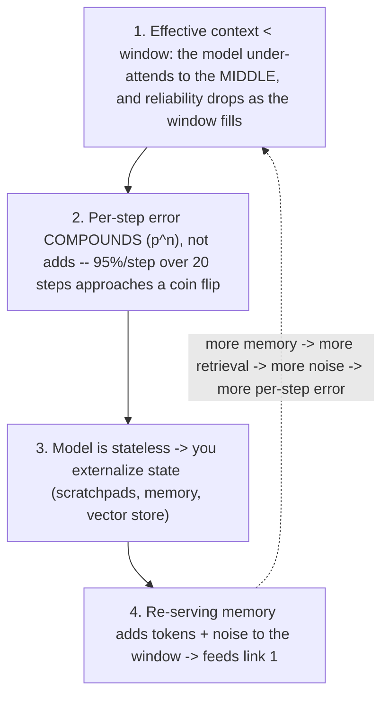

# Context curation -- choose the smallest sufficient context, not the biggest window

The shift this captures: the lever for a long-running agent is not how much
context it CAN hold, it is the quality of the decision about which tokens occupy
the window at each step. Capacity was never the binding constraint. Selection is.
As one practitioner put it: the question every agent answers on every step is
"of everything it knows, what should it be thinking about right now?" A bigger
window does not answer that -- it just gives the agent more to ignore.

Source: authored from a Khairallah AL-Awady (@eng_khairallah1) X article
(2026-06-17), which is a PAID PARTNERSHIP for a vendor memory product (HydraDB).
The failure-loop and selection ANATOMY below is sound and matches Anthropic's own
context guidance; the article's "buy a structured selection layer" product framing
is the sponsor's UNVERIFIED pitch and is OUT OF SCOPE here. Ground every feature
claim at docs.claude.com (context windows, compaction, context editing, the memory
tool), never at a vendor's claims.

Enriched 2026-07-16 from a Mari (@Tech_girlll) X article, "Why Your AI Agent Gets
Dumber Over Time" (2026-07-15), which restates this same failure loop under the
name "context rot" and adds two things worth keeping: an instrumentation discipline
(the four numbers below) and the item-by-item notes-update caution. Those are folded
in; the rest of the article maps onto the curation procedure already here. The
article's cited percentage gains and the "Agentic Context Engineering" paper it
leans on are UNVERIFIED here -- the instrumentation habit stands on its own without
them, so no borrowed number is asserted as fact.

## Why agents cliff -- the four-link loop
Long-horizon agents do not degrade gracefully; they hold, then suddenly fall off.
Four links make the loop, and seeing all four is what stops you reaching for the
wrong fix.

```mermaid
flowchart TD
    L1["1. Effective context < window: the model under-attends to the MIDDLE, and reliability drops as the window fills"] --> L2["2. Per-step error COMPOUNDS (p^n), not adds -- 95%/step over 20 steps approaches a coin flip"]
    L2 --> L3["3. Model is stateless -> you externalize state (scratchpads, memory, vector store)"]
    L3 --> L4["4. Re-serving memory adds tokens + noise to the window -> feeds link 1"]
    L4 -.->|"more memory -> more retrieval -> more noise -> more per-step error"| L1
```

Anthropic's own prompting guidance is the tell for link 1: it tells you to put
longform data at the TOP and your query at the END, because queries at the end can
improve response quality by up to 30% on complex multi-document inputs. Position
matters because attention is not uniform across the window. And compaction (the
harness's lossy summary when the window fills) throws away the subtle detail whose
importance only becomes clear later -- so "just hold more" quietly manufactures the
per-step errors that compound into the cliff.

## The principle
Not the largest available context, but the smallest SUFFICIENT one. Relevance
over recall. Deliberate forgetting as a first-class operation, not an accident of
truncation. Order-preserving retrieval of a few thousand well-chosen tokens beats
dumping a full 128K window into the model. The advantage is in choosing what
enters, not in how much can.

## Searching for its own context is how a bad pattern spreads
Front-load the context before the agent starts, because the search it runs instead is not neutral. When an agent has
to find its own references, whatever it opens enters the window and shapes the output -- including the modules
carrying the pattern you are trying to stop reproducing. Read half a dozen components that misuse a lifecycle hook
and the new component will misuse it too. The agent is not choosing bad examples; it is generating from what is in
front of it. So decide the references yourself: name the two or three files showing the pattern you want, state the
constraints, and only then hand over the task. This is why a planning pass helps even when the plan is discarded --
the useful output was a loaded window, not the document. Where the agent must search, scope the search narrowly
enough that it cannot return the parts of the codebase you are migrating away from. (@poteto, 6 X Articles read 2026-09-18; first-hand practitioner account, figures not carried.)

## The procedure
1. Budget the window as scarce. Assume the reliably usable fraction is far below
   the advertised number, and that it shrinks as you fill it. Every token you add
   is a token competing for the model's attention.
2. Position what matters at the edges. Put long shared documents at the top; put
   the actual task and question last. Do not bury the instruction in the middle.
3. Retrieve few, not many. Pull the smallest set that answers "what does THIS step
   need," in source order, instead of pasting the whole store or history.
4. Prefer relevance to similarity. Similarity search returns what is CLOSE, not
   what is RELATED -- and near-misses act as distractors that raise per-step error.
   Select by the relations that actually matter: dependencies, provenance, and what
   superseded what (the current value, not a stale one that merely embeds nearby).
5. Forget on purpose. Clear stale tool outputs before they pile up. When you
   compact, protect the decisions and drop the reasoning, not the reverse -- and
   know the summary is lossy, so keep durable facts in a structured store, not in
   the prose history.
6. Re-serve the minimum. Externalizing state is correct and necessary, but every
   retrieval re-enters the window. Pull the minimum slice each step rather than
   re-loading the whole memory "to be safe."
7. Keep the step count down. Because error compounds, fewer clean steps beat many
   noisy ones. Have the model write a script for a repeated deterministic operation
   instead of re-reasoning it each step (this also shrinks the context it carries).

## The other answer: keep the data BESIDE the window, not in it

Everything above chooses what goes into the window. There is a second answer that
changes the question, and it is worth knowing because it removes the failure this
skill exists to manage rather than mitigating it.

Give the agent a live execution environment -- a running Python session is the
worked example (Prime Intellect's prime-agent, 2026-08) -- and let large data live
in THAT process's memory rather than the model's context. Reading a 500KB log
becomes one line of code the model wrote; the file lands in a variable, and the
window holds the line, not the log. The model then queries it on demand: a regular
expression over the error lines, a slice of a few thousand characters, a count.

What this buys, and it is not a marginal gain:

- NO COMPACTION, so no summary loss. The standard long-session failure -- the
  window fills, history is replaced by a summary, and the detail that mattered was
  in a file read an hour ago -- cannot happen to data that never entered the
  window. Curation stops being a running cost.
- THE WORKING SET SURVIVES A CRASH if the environment is snapshotted to disk. A
  killed session comes back with its variables.
- SUB-AGENTS GET THEIR OWN ENVIRONMENT as well as their own window, so the same
  property holds recursively.

The costs are real and worth stating. The kernel's memory and any snapshot grow
with the run, so you have moved a context problem into a process-lifecycle problem
rather than deleting it. And the trade-off nobody expects: on one maze benchmark
the frugal harness explored SEVEN rooms where a conventional one explored
twenty-five. MANAGING CONTEXT WELL IS NOT THE SAME AS EXPLORING WELL -- an agent
that pulls in only what it asked for sees only what it thought to ask for. On
tasks where the win comes from wandering into things you did not plan to look at,
frugality is a handicap, and this skill's whole premise applies less than it
appears to.

So: treat this as the right architecture for long runs over large data with a
clear question, and treat conventional read-it-into-the-window as better for
exploration. The choice is between two failure modes, not between a good and a bad
design.

## Two mechanics worth naming: truncation, compaction, and reasoning state

Most discussion of "the window filled up" collapses three different things. They
have different failure signatures and it is worth being able to say which one you
are running:

- TRUNCATION drops the OLDEST content past a limit. Cheap, and it silently removes
  the beginning of the task -- the framing, the constraints, the early decisions.
  What survives is the recent, which is usually the least load-bearing part.
- COMPACTION summarizes the old content and keeps the summary. Better, and lossy in
  a different direction: detail goes, structure stays. The known failure is that a
  detail compacted away an hour ago was the one that mattered (`memory-lifecycle`
  on why a durable file beside the window beats trusting the summary).
- REASONING STATE is separate from both, and is the one people do not know they are
  choosing. Some harnesses discard the model's private working-out after each turn
  and carry only its visible output forward, so it keeps its NOTES but not the
  thinking that produced them, and re-derives that thinking next turn.

A fourth difference between the first two, and it is a COST difference rather than a
quality one: they do opposite things to the prompt cache. SUMMARIZING REWRITES THE
PREFIX, so every later call pays cold price on tokens that were warm before you
compacted. TRUNCATING TOOL OUTPUTS IN PLACE leaves the prefix byte-identical and the
cache alive. Both free context; only one keeps the discount. Note that this is
truncating tool OUTPUTS where they sit, not truncating the front of the history as in
the first bullet above -- the two operations share a name and have opposite risk
profiles, one dropping the framing and the other preserving it exactly.

This cuts against the reflex to compact by summarizing. Prefer in-place truncation
while it is sufficient, and treat a summarization pass as a deliberate purchase of
headroom at the price of a cold prefix, every turn, for the rest of the session. See
`cache-aware-sessions` for the economics that make that price concrete.

The reason to know the third exists: on one measured comparison, preserving
reasoning state plus compacting instead of truncating took the same model from 62.7%
to 99.9% on the same benchmark, and made reasoning effort almost irrelevant --
performance held even with thinking switched off. Memory substituted for reasoning.
If your agent seems to need a bigger thinking budget on a long task, check first
whether it is paying to rediscover something your harness threw away.

A third move sits between truncating and summarizing: OFFLOAD TO A PATH. Source: Hrushikesh Dokala
(@Hrushikeshhhh), "the fake fs, built on redis" (hrushikesh.dev/notes/fake-fs, 2026-08-24), from a search
agent handling tens of thousands of conversations a month; his numbers are UNVERIFIED. When a tool result
passes a token limit, write it to a virtual file and put a one-line pointer in the transcript ("result too
large -- saved to /tmp/...") in its place. Nothing is lost, because the agent can read the file back with the
same read tool it already uses, and the pointer is written once, so the prefix stays stable. The
"filesystem" behind it need not be one: his is a routing table on path prefix -- skills from a read-only
cache, artifacts to versioned object storage, a repository mounted only when relevant, scratch space with a
TTL -- behind four verbs (read, write or edit, list, search). The agent never learns which backend answered.

## Compaction eats rules the same way it eats facts, and rules fail silently
The mechanics section above covers what compaction does. This is the consequence people get caught by: a constraint
stated once in conversation -- do not touch that directory, always run the migration before the tests, stop and ask
before pushing -- is ordinary conversation text, and a summarisation pass keeps what looks load-bearing to the
summariser rather than what is load-bearing to you. A dropped FACT usually announces itself, because the next answer
is visibly wrong. A dropped RULE does not: the agent simply stops being constrained and behaves reasonably right up
until it does the thing you forbade an hour ago.
So put anything that must survive the session where compaction cannot reach it. In order of durability: a permission
or deny rule, which is enforced outside the model entirely; an instruction file or skill, which is re-injected rather
than summarised; and last, a message in the conversation, which is the weakest form and should be treated as a
preference for this turn rather than a boundary. The test is a question worth asking before stating any constraint in
chat: if this were silently forgotten in twenty minutes, would I notice before it mattered? If the answer is no, it
does not belong in chat. (@undefinedKi, 15 of 21 Articles read 2026-09-18; full procedures with runnable files, sponsored items disclosed.)

## Keep the context small enough that staleness is computable

Source: @danialhasan, "The Software Factory Trap", X article, 2026-05-21 (vendor-adjacent;
the argument below does not depend on his product).

The procedure above chooses the smallest context for QUALITY. There is a second reason, and it
matters for any work that outlives the session: a bounded context is the only kind you can
invalidate.

If a task ran on an approved bundle -- pricing requirement R17, the checkout API contract, the
payment test file -- the output provably depends on those three things, and when R17 changes
you can list exactly which work went stale. If the agent read half the repository, forty
documents and old chat threads, the only honest dependency record is "this may depend on
everything", and staleness detection is impossible. More context did not add understanding;
it destroyed the ability to know what the result rests on.

So record the context as a list, per task: the requirement, the sources that authorized it,
the contracts it touched, the assumptions it made, the checks that prove it, and the sources
whose change would invalidate it. A context graph earns its keep only in that scoped form --
a searchable dump of everything reproduces the problem at a larger size.

When a listed source does change, one reported practice (a founder's workflow he describes,
UNVERIFIED) is to REWRITE the impacted slice from the updated requirement rather than patch the
earlier partial edit, so drift does not accumulate one small fix at a time.

## Two configuration facts that spend context before you type anything
Both from a shipped-tooling author, 2026-09-19, and both checkable in a session right now rather than argued about.
- AN MCP SERVER MARKED TO LOAD ALWAYS PUTS ITS WHOLE TOOL LIST IN CONTEXT AT EVERY SESSION START, whether or not the
  work needs it. That is a fixed tax paid before the first prompt, on every session, forever. The default elsewhere
  is to defer tool definitions until a server is used; an always-load flag opts out of that. Audit the project MCP
  file for it.
- THE COMMAND THAT SETTLES IT: ask the session to print its full context breakdown, which lists what loaded and what
  each piece costs in tokens. That converts an argument about whether the instruction file is too long into a
  number, and it is the same measurement the instruction-file arithmetic in claude-md-rules asks for.
A related limit from the same source, worth knowing before designing around isolation: running a skill in a forked
child context only helps when the skill carries explicit INSTRUCTIONS. A skill that is only guidelines returns
nothing useful from a fork, because there was no procedure for the child to execute -- the isolation was real and
the work was not.

## Anti-patterns -- each maps to a skipped link
- Bigger-window reflex: raising the context limit to fix drift. It only raises the
  ceiling on how much rot you accumulate before the cliff. Fix: curate, do not
  enlarge.
- Dump-the-store retrieval: pasting the top-K similar chunks every step. Fix:
  select by relation and recency, smallest sufficient set, order preserved.
- Pack-rat history: never clearing old tool outputs or notes. Fix: deliberate
  forgetting -- clear and compact with the decisions protected.
- Similarity == relevance: trusting a vector index to know what matters now. Fix:
  encode dependencies/provenance/supersession, not just nearness.
- Re-load everything: pulling the full memory back in "to be safe." Fix: re-serve
  the minimum the step needs; each extra token is a distractor.

## Instrument it -- so you know the curation is working
Curation is invisible until you measure it, and "the agent feels worse" is not a
signal you can act on. Track four numbers across a change so you can tell curation
from luck:
- success rate on a FIXED set of test tasks (did the change help, or just move the
  noise around),
- tokens per SUCCESSFUL task (the cost of a win, not just the cost of running),
- how full the window runs at peak -- the earliest warning light; an agent that
  lives near its limit is already accumulating rot,
- cost per task.
If you watch only one, watch window fullness: it moves before quality does, so it
warns you before the cliff instead of after. If you only USE agents rather than
build them, the soft version still holds -- note the output quality at the start of
a session, and treat the moment you spend more time correcting than building as the
number moving.

When you keep durable facts in an external notes file (link 3 above), update that
file item by item -- add the one new decision, delete the one that was superseded --
rather than rewriting the whole summary each pass. Every full rewrite is a fresh
lossy compaction, so repeated re-summarizing quietly drops the exact detail that
only mattered three steps later. This is the same reason compaction protects
decisions over reasoning, applied to the store instead of the window; see
compounding-memory for the write/consolidate discipline.

## You have understood when
- You can explain why a bigger context window does not fix a drifting agent, in
  terms of effective context and compounding per-step error.
- You reach for "what is the smallest sufficient context for this step" before you
  reach for a larger model or more memory.
- You can say why similarity search is the wrong shape for selection, and what
  relational signal (dependency, provenance, supersession) you would select on
  instead.
- You can name the number you would watch to catch context rot early (window
  fullness), and why an item-by-item notes update keeps more detail than a full
  re-summary.
