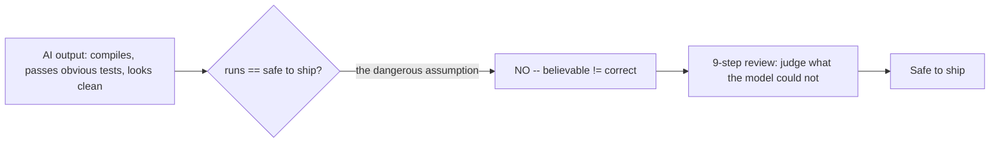
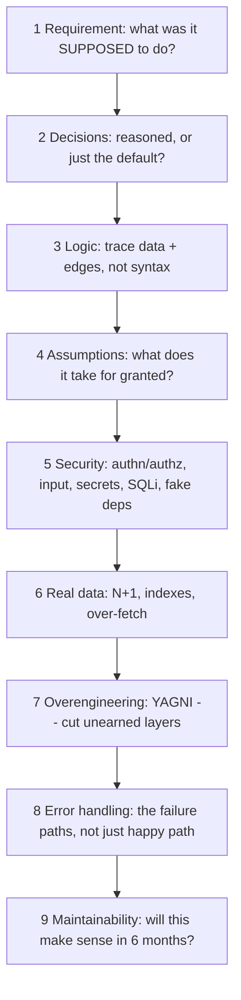

# Review AI-generated code like a senior developer

The gap this closes: AI writes a feature in seconds, it compiles, it passes the
obvious tests -- and "runs" is not the same as "safe to ship." The distance
between them is where the work now sits. Reviewing AI code is its own skill,
separate from writing it, because the code arrives without the thinking that
should come with it: the model guessed its way there from patterns and cannot
tell you why it chose what it chose.

Source: authored from a Mari (@Tech_girlll, freeCodeCamp writer) X article
(2026-06-19, UNVERIFIED creator stats -- e.g. the "35% of AI backend code secure
and correct" and Veracode "~half shipped a known weakness" figures are the
author's citations, not measured by us). The grounded references (OWASP Top 10,
YAGNI, slopsquatting, N+1) are real and checkable. Model-agnostic but aimed at a
Claude Code workflow.

## Three things to know before you start
Almost every step below traces to one of these:
1. The tool is optimized to give a BELIEVABLE answer fast, not a correct one.
   Believable and correct overlap often enough that you stop expecting the gap.
2. When your request leaves something out, the model does not ask -- it fills the
   gap with the most common thing in its training data (the popular framework,
   the default structure), whether or not your case calls for it.
3. It sounds exactly as sure when it is wrong as when it is right. There is no
   tell, so you cannot lean on its confidence -- check names, numbers, and
   anything in a domain you do not know well enough to catch the error yourself.

## The 9 steps, in order

1. Start with the problem, not the code. AI can solve the wrong problem
   flawlessly ("update invoices" endpoint with clean logic and no check that the
   caller is allowed). Find the requirement first (ticket, spec, one sentence),
   then read the code as a comparison: asked-for vs built, do they match? If you
   cannot state in one sentence what the code was meant to solve, you are not
   ready to review it. A one-line prompt means every unstated gap is a guess you
   are now also reviewing.
2. Question the engineering decisions. Every choice (framework, database,
   pattern) should weigh options and pick one for a reason; the model usually
   reaches for the common default instead. Ask on every major choice: does this
   fit my case, or is it just the popular answer? "Because it is common" does not
   count. (Example: "Python web backend" maps to Django in training data even
   when an async-first service wants FastAPI.)
3. Read the logic, not the spelling. Syntax errors are caught for free by the
   compiler and linter -- the cheap bugs. The expensive ones live in the logic
   and slip past a quick read because the code looks polished. Trace the data in
   to out; check the edges (empty list, zero, negative, max value, off-by-one),
   race conditions, and the FAILURE path of each step. Generated code is tuned to
   look right on the one path the prompt described; the edges are what the prompt
   left out.
4. Hunt the hidden assumptions (the step that catches the most real bugs). An
   assumption is something the code quietly needs to be true. The usual suspects:
   inputs are always valid, external services always answer, the record always
   exists, the network always works. The code works while the assumptions hold --
   and they hold until an ordinary Tuesday. For each one found, add the path that
   handles it being false. An unchecked assumption is an incident that has not
   happened yet.
5. Go through security deliberately -- the one step never to rush. Working and
   wide-open are unrelated as far as the model is concerned. Item by item:
   authentication (is identity checked?), AUTHORIZATION (the big one -- OWASP
   ranks broken access control #1; the per-endpoint "is THIS person allowed to do
   THIS" check is exactly what models underweight), input validation, exposed
   secrets (hardcoded keys -> environment variables), SQL injection (parameterize
   queries), and hallucinated dependencies (models invent package names; an
   attacker can pre-register the made-up name -- "slopsquatting" -- so verify
   every suggested package against the real registry). And the other direction:
   do not paste real keys, credentials, or proprietary logic INTO the prompt.
6. Check behavior with real data. Performance bugs hide when the test DB has
   twelve rows. The classic is the N+1 query (one query for a list, then one more
   per item -- 10,000 items, 10,001 queries). Look for queries inside loops
   first; also missing indexes, too many separate calls, over-fetching whole rows
   for two fields. Most frameworks have a tool that shows every query a page runs.
7. Cut the overengineering. AI also does the opposite of cutting corners -- it
   pattern-matches on big codebases and adds wrappers, service layers, and config
   for things never configured. YAGNI ("You Aren't Gonna Need It"): an
   abstraction earns its keep only when it absorbs change that is actually
   happening. "In case we need it later" -> cut it; adding it later is usually
   cheap.
8. Look for the error handling. Generated code spends almost all its lines on the
   happy path. Flag: no failure path for an operation that can fail; a catch-all
   that swallows every error; external calls with no plan for an error; no
   fallback (no retry, no safe default). For each operation that can fail, make
   the code answer what happens when it does -- catch specific errors, log enough
   to debug, retry where it makes sense, fall back to something safe. (This is the
   same discipline as fallback-and-recovery.)
9. Ask whether you could maintain it. Code is read far more than written, usually
   by you six months later with no memory of the prompt. Three questions: would I
   understand this cold in six months? Could someone new maintain it without a
   walkthrough? Is it simple enough to debug fast at a bad time? A "no" is a
   finding -- fix it now while renaming and simplifying are cheap.

## The meta-habit
Spend more time reviewing the code than it took to generate. The ratio feels
wrong the first few times and then feels obviously right. Treat every generated
snippet as a draft from a contributor who is fast, confident, and occasionally
careless -- because that is exactly what it is. Your job is not to confirm the
code runs; it is to decide whether it is safe and correct to ship, a judgment the
model cannot make because it cannot see your system, your users, or the page that
goes off at 3am.

## Pre-merge checklist
- Requirement: do I know what this was supposed to solve, and does it?
- Decisions: is each framework/database/pattern reasoned for this case?
- Logic: traced the flow, checked the edges and failure paths?
- Assumptions: inputs, services, records, network -- what is taken for granted?
- Security: authn, authz, input validation, exposed secrets, SQL injection,
  made-up packages?
- Performance: N+1, missing indexes, too many calls, over-fetching?
- Complexity: is every layer earning its place?
- Error handling: failure paths, fallbacks, retries?
- Maintainability: will this make sense to someone else in six months?
- My own inputs: did I keep secrets out of the prompt?

## Relation to the curriculum (ConceptForge)
The why lives in verification-lifecycle (defense-in-depth: a ladder of cheap-to-
costly checks; the writer is not the grader) and reward-hacking (the model that
sounds confident while wrong). This skill is the concrete reviewer's PROCEDURE
for AI-written code specifically -- the per-dimension checklist that sits inside
the "fresh-context reviewer" rung. Step 8 overlaps fallback-and-recovery (failure
paths); step 5's input-validation overlaps structured-outputs (trust the shape
before you use it).
