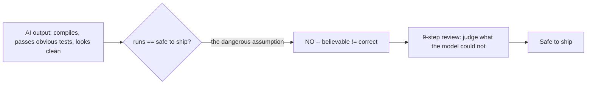
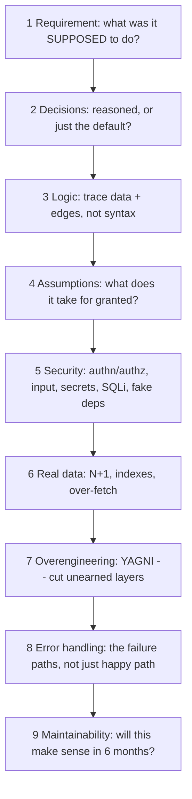

# Review AI-generated code like a senior developer

The gap this closes: AI writes a feature in seconds, it compiles, it passes the
obvious tests -- and "runs" is not the same as "safe to ship." The distance
between them is where the work now sits. Reviewing AI code is its own skill,
separate from writing it, because the code arrives without the thinking that
should come with it: the model guessed its way there from patterns and cannot
tell you why it chose what it chose.

Source: authored from a Mari (@Tech_girlll, freeCodeCamp writer) X article
(2026-06-19, UNVERIFIED creator stats -- e.g. the "35% of AI backend code secure
and correct" and Veracode "~half shipped a known weakness" figures are the
author's citations, not measured by us). The grounded references (OWASP Top 10,
YAGNI, slopsquatting, N+1) are real and checkable. Model-agnostic but aimed at a
Claude Code workflow.

## THE CARD -- everything this skill guarantees, in the part that survives truncation
After a long conversation compacts, Claude Code re-injects an invoked skill capped at 5,000 tokens and keeps
the START of the file. This skill is longer than that, so the sections below the cut are elaboration you may
not have. Everything load-bearing is restated here.

THE REASON THIS SKILL EXISTS: generation stopped being the constraint and REVIEW became it, and review did not get
faster, because a person still has to hold the change in their head. A team that ignores that keeps shipping and
quietly stops understanding its own system. Nothing breaks on merge day; it breaks later, and the cost is learning
your own codebase under pressure at the moment something is already wrong.
SO VOLUME IS THE ENEMY. A smaller change that is fully understood beats a larger one that merely passes.
THE PRE-MERGE CHECKLIST, which is the deliverable of this skill:
- REQUIREMENT: do I know what this was supposed to solve, and does it?
- DECISIONS: is each framework, database and pattern reasoned for THIS case, or defaulted?
- LOGIC: have I traced the flow, the edges and the failure paths, not just the happy one?
- SECURITY: what does this trust that it should not, and what does it expose?
- TESTS: do they test the behaviour or restate the implementation?
- FOOTPRINT: what does this change make harder later, and what does it commit us to?
THE FAILURE THAT HIDES BEHIND A GREEN TEST RUN, and check for it every time: WERE THE TESTS CHANGED IN THE SAME DIFF
AS THE CODE THEY COVER? An agent that meets a failing test will edit the test to match what it believes the goal
was. Most of what it writes is sound; the small remainder pins broken behaviour in place, and it is invisible
afterwards because the suite is green.

## Three things to know before you start
Almost every step below traces to one of these:
1. The tool is optimized to give a BELIEVABLE answer fast, not a correct one.
   Believable and correct overlap often enough that you stop expecting the gap.
2. When your request leaves something out, the model does not ask -- it fills the
   gap with the most common thing in its training data (the popular framework,
   the default structure), whether or not your case calls for it.
3. It sounds exactly as sure when it is wrong as when it is right. There is no
   tell, so you cannot lean on its confidence -- check names, numbers, and
   anything in a domain you do not know well enough to catch the error yourself.

```mermaid
flowchart LR
    Gen["AI output: compiles, passes obvious tests, looks clean"] --> Gap{"runs == safe to ship?"}
    Gap -->|"the dangerous assumption"| No["NO -- believable != correct"]
    No --> Rev["9-step review: judge what the model could not"]
    Rev --> Ship["Safe to ship"]
```

## The 9 steps, in order

```mermaid
flowchart TD
    S1["1 Requirement: what was it SUPPOSED to do?"] --> S2["2 Decisions: reasoned, or just the default?"]
    S2 --> S3["3 Logic: trace data + edges, not syntax"]
    S3 --> S4["4 Assumptions: what does it take for granted?"]
    S4 --> S5["5 Security: authn/authz, input, secrets, SQLi, fake deps"]
    S5 --> S6["6 Real data: N+1, indexes, over-fetch"]
    S6 --> S7["7 Overengineering: YAGNI -- cut unearned layers"]
    S7 --> S8["8 Error handling: the failure paths, not just happy path"]
    S8 --> S9["9 Maintainability: will this make sense in 6 months?"]
```

1. Start with the problem, not the code. AI can solve the wrong problem
   flawlessly ("update invoices" endpoint with clean logic and no check that the
   caller is allowed). Find the requirement first (ticket, spec, one sentence),
   then read the code as a comparison: asked-for vs built, do they match? If you
   cannot state in one sentence what the code was meant to solve, you are not
   ready to review it. A one-line prompt means every unstated gap is a guess you
   are now also reviewing.
2. Question the engineering decisions. Every choice (framework, database,
   pattern) should weigh options and pick one for a reason; the model usually
   reaches for the common default instead. Ask on every major choice: does this
   fit my case, or is it just the popular answer? "Because it is common" does not
   count. (Example: "Python web backend" maps to Django in training data even
   when an async-first service wants FastAPI.)
3. Read the logic, not the spelling. Syntax errors are caught for free by the
   compiler and linter -- the cheap bugs. The expensive ones live in the logic
   and slip past a quick read because the code looks polished. Trace the data in
   to out; check the edges (empty list, zero, negative, max value, off-by-one),
   race conditions, and the FAILURE path of each step. Generated code is tuned to
   look right on the one path the prompt described; the edges are what the prompt
   left out.
4. Hunt the hidden assumptions (the step that catches the most real bugs). An
   assumption is something the code quietly needs to be true. The usual suspects:
   inputs are always valid, external services always answer, the record always
   exists, the network always works. The code works while the assumptions hold --
   and they hold until an ordinary Tuesday. For each one found, add the path that
   handles it being false. An unchecked assumption is an incident that has not
   happened yet.
5. Go through security deliberately -- the one step never to rush. Working and
   wide-open are unrelated as far as the model is concerned. Item by item:
   authentication (is identity checked?), AUTHORIZATION (the big one -- OWASP
   ranks broken access control #1; the per-endpoint "is THIS person allowed to do
   THIS" check is exactly what models underweight), input validation, exposed
   secrets (hardcoded keys -> environment variables), SQL injection (parameterize
   queries), and hallucinated dependencies (models invent package names; an
   attacker can pre-register the made-up name -- "slopsquatting" -- so verify
   every suggested package against the real registry). And the other direction:
   do not paste real keys, credentials, or proprietary logic INTO the prompt.
6. Check behavior with real data. Performance bugs hide when the test DB has
   twelve rows. The classic is the N+1 query (one query for a list, then one more
   per item -- 10,000 items, 10,001 queries). Look for queries inside loops
   first; also missing indexes, too many separate calls, over-fetching whole rows
   for two fields. Most frameworks have a tool that shows every query a page runs.
7. Cut the overengineering. AI also does the opposite of cutting corners -- it
   pattern-matches on big codebases and adds wrappers, service layers, and config
   for things never configured. YAGNI ("You Aren't Gonna Need It"): an
   abstraction earns its keep only when it absorbs change that is actually
   happening. "In case we need it later" -> cut it; adding it later is usually
   cheap.
8. Look for the error handling. Generated code spends almost all its lines on the
   happy path. Flag: no failure path for an operation that can fail; a catch-all
   that swallows every error; external calls with no plan for an error; no
   fallback (no retry, no safe default). For each operation that can fail, make
   the code answer what happens when it does -- catch specific errors, log enough
   to debug, retry where it makes sense, fall back to something safe. (This is the
   same discipline as fallback-and-recovery.)
9. Ask whether you could maintain it. Code is read far more than written, usually
   by you six months later with no memory of the prompt. Three questions: would I
   understand this cold in six months? Could someone new maintain it without a
   walkthrough? Is it simple enough to debug fast at a bad time? A "no" is a
   finding -- fix it now while renaming and simplifying are cheap.

   Part of the same question: search for the capability before accepting a new one. An
   agent reads the files near its task and can build a second implementation of something
   the codebase already does (Zach Lloyd, 2026-04-08: tables rendered twice, once for markdown files and once
   for streamed agent responses). Before accepting a new helper, parser or component,
   search by name AND by behaviour. When two planned features share a capability, say so
   in the prompt and ask for the shared implementation first. The same failure one level
   up: forcing an ill-fitting existing API with workaround code instead of building the
   API the context needs.

## The meta-habit
Spend more time reviewing the code than it took to generate. The ratio feels
wrong the first few times and then feels obviously right. Treat every generated
snippet as a draft from a contributor who is fast, confident, and occasionally
careless -- because that is exactly what it is. Your job is not to confirm the
code runs; it is to decide whether it is safe and correct to ship, a judgment the
model cannot make because it cannot see your system, your users, or the page that
goes off at 3am.

## When the diff outgrows the reviewer

The nine steps assume a change one person can hold in their head. At volume that
assumption breaks, and the thing that breaks is not the reviewer's time budget.
It is conceptualization. A two-thousand-line pull request draws the response "it
looks like code to me", and the approval that follows means nothing -- which is
worse than a slow review, because it reads as a passed gate.

Anthropic's own labs group describes moving the review OFF the diff and onto an
intent artifact (Mike Krieger, AI Engineer talk, 2026-09). The agent produces a
written companion to the change: what the change was for, what trade-offs were
made, and why. The reviewer reads that first and goes to the diff only for the
questions it raises. Alongside it, a second habit: instead of reading every line,
put the questions you WOULD have asked to the model and have it investigate them
against the code and report back. The model does retrieval; you choose the
questions and you decide what the answers mean. Krieger is explicit that he does
not review every line and does not claim to.

Three conditions, without which this is a gap rather than a shift:

- IT COMPRESSES THE NINE STEPS, IT DOES NOT REPLACE THEM. The steps become the
  question list you bring to the interrogation. A reviewer who has not internalized
  them has nothing to ask and is just reading a summary.
- THE VERIFICATION HAS TO EXIST SOMEWHERE ELSE. Trading line-by-line reading for
  intent review is only honest where types, tests, staged rollout and production
  measurement catch what you stopped reading. The same account pairs it with
  fixing forward, feature flags, and pre-measuring metrics BEFORE you need them --
  the worst position in an incident being a number you cannot tell is abnormal
  because you only started collecting it today.
- IT IS TIERED BY BLAST RADIUS, NOT BY DIFF SIZE. Architecture-touching changes
  stay deliberately bottlenecked on a human. Cosmetic and visual changes fix
  forward. Sort on "if this is wrong, is it reversible and would I notice?", which
  is a different question from how many lines moved.

A second practitioner arrives at the same fresh-context requirement from the
opposite end, which is worth noting because they agree without sharing a premise:
in a skills-based delivery pipeline, the final review runs in SUBAGENTS rather
than in the session that wrote the code, on the stated grounds that a model is a
poor editor of work it just produced -- having written it, it reads it as correct.
That review runs on two axes, and the pair is the useful part: against the SPEC
(which catches what the task breakdown under-specified, the failure a per-ticket
review cannot see) and against the standards documented in the repo (falling back
to general code-smell criteria when the repo documents none). See
`decision-frontier-planning` for where that sits in a delivery flow.

And one guard the source does not state, which this skill does: DO NOT APPROVE THE
ARTIFACT INSTEAD OF THE CHANGE. An explanation written by the same agent that
wrote the code is not independent evidence. It tells you the intent; it cannot
tell you whether the code matches the intent, and a model that guessed wrong will
describe its guess with the same confidence it wrote it with (point 3 above). The
claims that would have been caught by steps 3 to 5 -- logic, assumptions, security
-- get confirmed against the code or by a fresh-context reviewer, never against
the summary.

### When the PR outgrows the MODEL's context

The section above is about a human reviewer who can no longer hold the change. The
same wall exists for an automated reviewer, and it fails more quietly. From
Puneet Patwari (@system_monarch), Principal Engineer at Atlassian, "SD Round: Design an AI Code Review Agent" (2026-05-13), which
he presents as a design question AI labs ask (his claim): a pull request whose diff
is 180,000 tokens against a 128,000-token context, with the worst bug in file 37 --
the file the model never saw. The problem stops being "how do I fit the PR in the
prompt" and becomes "how do I build a reviewer that cannot miss the file that
matters".

The design, in order: DIFF PARSER -> CHANGE GRAPH -> RISK SCORER -> RETRIEVAL ->
MULTI-PASS REVIEWERS -> EXTERNAL MEMORY -> COVERAGE TRACKER -> FINAL VERIFIER.
- PARSE DETERMINISTICALLY FIRST. Changed files, functions, imports, config and API
  changes, tests and ownership come out of code, before any model call.
- BUILD A CHANGE GRAPH. A file that looks minor on its own is critical when it touches
  a shared utility, an auth check, a schema or an API contract.
- RANK BY RISK, NOT SIZE. A 12-line permission change can outrank a 700-line UI
  refactor -- the same blast-radius sort as the section above, now done by the system.
- SCAN EVERY FILE AT LEAST ONCE, then spend the deep pass only where the light pass
  found risk. "Review the top ten files" is how the file-37 bug ships.
- RETRIEVE CONTEXT ON DEMAND: callers, tests, interfaces, configuration and the old
  behaviour around the change, rather than more of the diff.
- SEVERAL LENSES ON THE SAME PR -- security, correctness, API compatibility,
  performance, test coverage -- each as its own reviewer.
- KEEP MEMORY OUTSIDE THE MODEL: file summaries, detected risks, dependency links, open
  questions and per-file status live in a store, not in the context.
- TRACK COVERAGE EXPLICITLY. The output lists every file as scanned, deeply reviewed,
  skipped, or flagged for a human. A skipped file is stated, never implied.
- FORCE THE CROSS-FILE CHECK: when one file changes a contract, search every place
  that still assumes the old one.
- ABSTAIN OUT LOUD. When the agent could not inspect enough context, it says that part
  needs human review instead of approving with confidence.
His closing line is the whole design: do not make the model remember everything --
build the system that decides what the model must inspect next. What the article
leaves out and a real build needs: a cost and latency budget, an evaluation set of
known bugs, and false-positive control.

## Tuning an automated reviewer: three settings that decide what it finds

Once review runs through a prompt or skill rather than your eyes, its output is
determined less by the model than by three choices in the file. All three come
from a practitioner comparing review skills on his own code (2026-05).

AUTHORIZE IT PAST THE DIFF, EXPLICITLY. Hand an agent a diff and it treats the
diff as the boundary of what it may propose -- it will polish what is in front of
it and never say that the change should not exist in this shape, or that the right
fix is two files away. A review instruction that says to start from the change and
then look through the codebase for the cleaner structure produces a
categorically different class of finding. The ones worth having are usually
outside the diff, because the diff is where the author was already looking.

TUNE FOR RECALL, NOT PRECISION, AND SAY SO. An ambitious reviewer produces more
false positives. That trade is correct, and the reason is worth stating in full
because it is not intuitive: a false positive costs one line of "no, that is
fine", and you see it and dispose of it. A false negative costs an improvement you
never learn existed -- there is no moment at which you notice the reviewer stayed
quiet. The cheap error is visible and the expensive error is silent, so tune
towards noise. This is the same asymmetry that makes a strict linter worth its
irritation.

MAKE IT RANK, AND MAKE IT RULE. Two output requirements, both cheap to add and
both load-bearing. Rank the findings in a stated order -- structural problems
first, legibility last -- or a long list arrives flat and the important item sits
below three naming quibbles. And require a VERDICT against a stated bar: approve
or reject, not a list. A reviewer that only enumerates never says the thing you
most need to hear, which in his run was that the behaviour was correct in every
change and the codebase was measurably worse than the week before. No individual
finding says that.

One thing to check for in any review prompt you adopt, because it was missing from
a good one: whether it looks at the TEST surface and the seams at all, or only at
source. A reviewer that never asks whether this change made the next change easier
to verify is optimizing half the problem -- see `codebase-onboarding` on why
that half compounds.

A REVIEW HOOK MUST END IN AN EXIT CODE. A pre-commit hook that asks a model to review
the staged diff and prints the answer blocks nothing (the published version never exits
non-zero). Require a fixed first line, BLOCK or PASS, and have the script exit 1 on
BLOCK. Decide in advance what happens when the model call itself fails: fail closed for
secrets, auth and payments, fail open elsewhere. Review only staged files, set a
timeout, test it by committing a planted fake key, and run the same check in CI because
`--no-verify` skips the hook. (@cyrilXBT, 2026-04-29.)

### Let the people it reviews for tune it -- without letting them tune it quiet
A reviewer that runs from a skill file can improve from the reactions to its own
findings, if the feedback is collected where the review happens and applied through
the same gate as any other change. From Zach Lloyd (@zachlloydtweets, founder of
Warp), "What comes after human code review", 2026-05 -- Warp-only evidence and no
numbers, so treat it as a design, not a result:
1. CAPTURE ON THE PR. A person replies to each finding with a fixed token -- useful,
   noise, or missed plus what was missed. A fixed vocabulary is what makes the replies
   countable later.
2. HARVEST ON A SCHEDULE, IN A SEPARATE RUN. A scheduled job, not the reviewer in the
   session that produced the findings, gathers the replies since its last run and
   groups them by kind of finding.
3. PROPOSE, DO NOT APPLY. It opens a PR against the reviewer skill: lower the emphasis
   on a kind of finding rated noise several times, or add a check for a miss reported
   more than once. A human merges it like any other diff -- the proposal tier from
   agent-engineering self-improving-loop, applied to the reviewer itself.
4. HOLD RECALL FIXED. This is the guard the source does not state and the section
   above requires. Noise ratings pull toward precision, and a reviewer tuned only on
   what annoyed people converges on saying nothing -- the silent, expensive error
   described above. The harvest may reshape WHAT the reviewer looks for; it may not
   lower HOW MUCH it reports.
Two limits worth keeping in view: ratings from the same team can teach the reviewer
that team's blind spots rather than correct them, and a coding agent and a reviewing
agent can share blind spots that human ratings reduce but do not remove.

## Two questions that catch what a checklist misses
From a data engineer reviewing agent output in production, and they are worth asking on every change before the
mechanical checks below.
1. DID IT FIX THE CAUSE OR SILENCE THE SYMPTOM? A broad try-except, a widened type, a retry wrapped around a call
   that fails for a reason, a test assertion relaxed to match the output -- each makes the error go away and leaves
   the defect in place. The tell is a change that makes something stop being visible without explaining why it was
   happening.
2. WOULD I BE HAPPY IF ANOTHER ENGINEER COPIED THIS PATTERN IN SIX MONTHS? Agent output is read as precedent by the
   next agent and the next person, and a pattern merged once gets reproduced by whatever searches the codebase for
   examples. This is the question that catches the change which is locally correct and sets a bad standard.
Both are cheap, neither is automatable, and they fail different things from the checklist below -- the checklist
finds what is wrong with the diff, these find what is wrong with keeping it.

## Pre-merge checklist
- Requirement: do I know what this was supposed to solve, and does it?
- Decisions: is each framework/database/pattern reasoned for this case?
- Logic: traced the flow, checked the edges and failure paths?
- Assumptions: inputs, services, records, network -- what is taken for granted?
- Security: authn, authz, input validation, exposed secrets, SQL injection,
  made-up packages (check every unfamiliar dependency EXISTS and is the one you
  meant -- a hallucinated package name is not merely a broken import, it is a name
  an attacker can register and wait at, which is a documented supply-chain route)?
- Performance: N+1, missing indexes, too many calls, over-fetching?
- Complexity: is every layer earning its place?
- Error handling: failure paths, fallbacks, retries?
- Maintainability: will this make sense to someone else in six months?
- My own inputs: did I keep secrets out of the prompt?
- Blast radius: if this is wrong, is it reversible, and would I see it -- flag,
  rollback path, a metric already being collected?
- Indirection: did this change behaviour at sites reached through an interface, a
  callback, or a dynamic reference -- and if so, did I ENUMERATE those sites rather
  than trust the suite?

AFTER AN INDIRECTION-HEAVY CHANGE, TESTS PASSING IS NOT EVIDENCE. The asymmetry is
worth holding onto because it decides how much scrutiny a diff deserves. A missed
site in a plain RENAME fails loudly: the build breaks and you find out immediately.
A missed site in a BEHAVIOUR CHANGE reached through indirection compiles, passes
every existing test, and ships, because no one wrote a test for a connection no one
knew existed -- and it resurfaces later with nothing pointing back here. So when a
change touches an interface, a callback, or a dynamic reference, enumerate the
structural call sites by hand or by tooling BEFORE believing green. Green means the
tests that exist passed, which is a different claim from the one you want. See
`agent-ready-codebase` on why text search cannot enumerate that set for you.

## The failure that hides behind a green test run
Check whether the TESTS were changed in the same diff as the code they cover. Left alone, a coding agent that hits a
failing test will edit the test to match what it believes the goal was. Most of what it writes is sound; the small
remainder pins the broken behaviour in place, and it is invisible afterwards because the suite is green. Two
controls. Put a standing rule in the instructions file: if a test fails after a change, stop and report it, never
modify a test to make a change pass. And at review, read test edits as a separate pass from code edits, asking of
each one what behaviour it used to assert. Two habits from the same account go with it: keep the working context well
below the advertised window, and commit each phase of a plan separately so review runs per commit rather than on an
accumulated diff. (@hooeem, 2026-09-18 intake; UNVERIFIED practitioner framing, no figure of his is carried.)

## The bottleneck moved, and that is the whole case for reviewing at all
Worth stating plainly because it is the reason this skill exists rather than a nice-to-have.
GENERATION IS NO LONGER THE CONSTRAINT. A team can now produce more code in a week than it can absorb in a month.
The constraint moved to REVIEW, and review did not get faster, because a person still has to hold the change in
their head to judge it.
WHAT HAPPENS WHEN YOU IGNORE THAT: the team keeps shipping and quietly stops understanding its own system. Nothing
breaks on the day it is merged. It breaks later, and the cost is not the bug -- it is trying to learn your own
codebase after the fact, under time pressure, at the moment something is already wrong. That debt is called
comprehension debt and it is invisible on every dashboard, because everything is green and velocity is up.
THE TEST, and it is uncomfortable: pick a file your team merged last month and ask who can explain why it works.
If nobody can, the code exists but the understanding does not, and the understanding is the thing that lets you
change it safely.
THE CONSEQUENCE FOR HOW YOU REVIEW: you are not checking the diff for defects. You are deciding whether the system
is still one a person can reason about. That is why the steps in this skill ask what a change makes harder, and
what it commits you to, and not only whether it works.
AND IT IS WHY VOLUME IS THE ENEMY. If review is the bottleneck, generating more is not progress. A smaller change
that is fully understood beats a larger one that is merely passing, and the right response to "we can generate
this in an afternoon" is usually to generate less of it.
