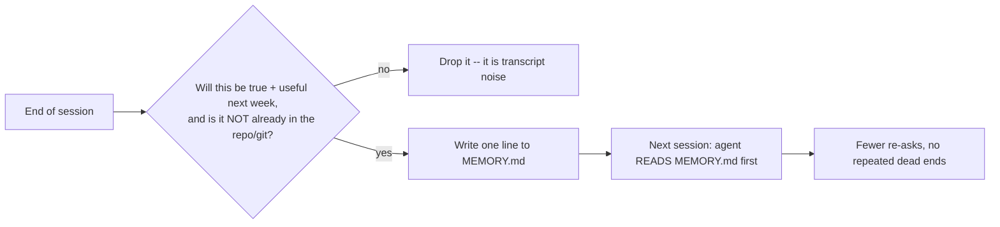
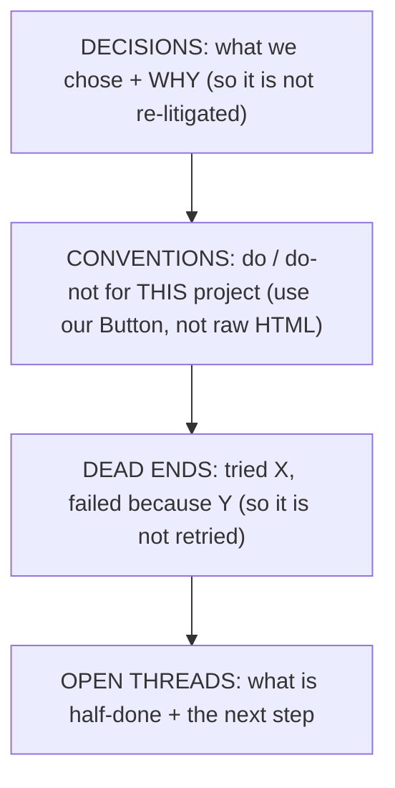

# Session handoff memory: fix the agent that forgets everything each session

The gap this closes: every Claude Code session starts cold. The agent has no
memory of the decisions you made yesterday, the conventions it learned, or the
three approaches you already tried and rejected. So each session it re-asks what
you told it last time, re-explores the same files, and -- worst -- confidently
repeats a wrong guess you already ruled out. People describe it as "a brilliant
new hire, every single day, who read none of yesterday's notes."

The naive fix makes it worse: paste the whole last transcript back into the new
session. Now the context window is full of chatter, the one useful decision is
buried in the middle where attention is weakest, and the agent is slower and
often misses it. Memory is not "keep everything." It is "keep the few durable facts and
drop the rest."

Source: authored from a recurring, heavily-upvoted r/ClaudeAI demand (many
separate projects rebuild cross-session memory; the "brilliant new hire with zero
memory" framing and the Graphify LESSONS.md pattern are community examples,
UNVERIFIED as products). The mechanism -- curated handoff beats transcript dump --
is grounded in context-management (lost-in-the-middle) and is model-agnostic.

## The one rule
A memory file is a CURATED set of durable facts the agent maintains, not a log it
appends to. If a line will not still be true and useful next week, it does not go
in. Everything the git history, the code, or CLAUDE.md already records stays OUT --
memory is for what is NOT derivable from the repo.

## What actually belongs in memory (four buckets)
Keep the file short and sorted into these. One fact per line.

1. DECISIONS, each with its reason. "We use Postgres, not Mongo, because the data
   is relational and we need joins." The reason is the point -- without it the
   agent (or you) re-opens the debate every time. A decision with no why is a
   decision that gets undone.
2. CONVENTIONS specific to this project. "Always use the shared Button component,
   never a raw HTML button." "Tests live next to source, not in a tests/ tree."
   These are the hyper-specific rules that encode YOUR codebase, which the model
   cannot guess and will otherwise default away from.
3. DEAD ENDS. "Tried server-side rendering for the dashboard; abandoned it because
   the auth cookie was not available at render time." This is the highest-value
   bucket and the one everyone forgets to keep. It is the exact thing the agent
   will cheerfully re-suggest next session, costing you the same hour twice.
4. OPEN THREADS. What is half-finished and the single next step. "Payment webhook
   verifies the signature but does not yet handle the refund event -- next: add
   the refund branch." This is the handoff to tomorrow's cold session.

## The loop (two moments, that is all)
- SESSION START: the agent reads MEMORY.md before doing anything else. If you use
  Claude Code, point CLAUDE.md at it ("Read MEMORY.md first and follow it") so it
  loads every session without you asking.
- SESSION END (or the moment a problem is resolved): append the durable facts from
  this session and PRUNE anything now wrong. A dead end that got solved becomes a
  decision; a decision that got reversed gets deleted, not left to rot. Five
  minutes of curation, not a transcript paste.

## What NOT to put in memory (the discipline is in the cuts)
- The transcript. If you find yourself pasting the conversation, stop -- that is
  the anti-pattern this skill exists to replace.
- Anything git already records: file structure, what changed, past commits. Do not
  duplicate the repo; memory is only for what the repo does NOT say.
- Secrets: keys, tokens, passwords. A memory file gets committed and shared.
- Ephemeral state: "currently the test is red." It will not be true next week.
- Unbounded growth. If MEMORY.md passes a page or two, it has stopped being memory
  and become a log again. Merge, cut, and keep it scannable -- a file too long to
  read at session start is a file the agent will skim and miss the middle of (the
  same lost-in-the-middle failure as the transcript dump).

## Break-it-on-purpose
Run two sessions with NO memory file on a real project: watch the second session
re-ask your stack, re-explore the same files, and re-propose something you killed
in session one. Now overcorrect -- paste the entire first transcript into session
two. The agent slows down, and the one decision that mattered is buried mid-context
where it half-ignores it. The curated file is the point between the two failures:
the four buckets above, nothing else.

## Pre-flight checklist
- Does a MEMORY.md exist, and does the agent read it at session start (CLAUDE.md
  points to it)?
- Are decisions written WITH their reason?
- Are project conventions captured (the do / do-not the model cannot guess)?
- Are dead ends recorded so they are not retried?
- Is the single next step for each open thread written down?
- Did I prune what is now wrong, and keep the file to a page or two?
- No secrets, no transcript, nothing git already records?

## Relation to the curriculum (ConceptForge / agent-engineering)
The why lives in context-management and the agent-engineering
handoff pattern; this skill is the concrete cross-session procedure.
